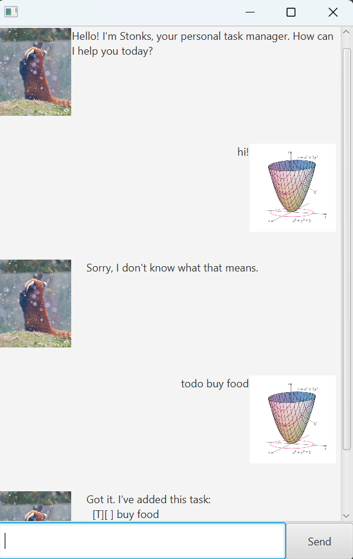

# Stonks User Guide



Stonks is a chatbot that helps you keep track of your tasks. It is optimized for use via a Command Line Interface (CLI) while still having the benefits of a Graphical User Interface (GUI). If you can type fast, Stonks can help you keep track of your tasks faster than traditional GUI apps.

Stonks currently supports 3 types of tasks:
1. ToDos: tasks without any date/time attached to it e.g., visit new theme park
2. Deadlines: tasks that need to be done before a specific date/time e.g., submit report by 11/10/2019 5pm
3. Events: tasks that start at a specific date/time and ends at a specific date/time e.g., (a) team project meeting 2/10/2019 2-4pm (b) orientation week 4/10/2019 to 11/10/2019

## Adding todos

Add a todo to your task list.

Command format: `todo (task description)`

```
example input: todo CS2103T iP
expected output: 
    Got it. I've added this task:
    [T][ ] CS2103T iP
    Now you have 1 task in the list.
```

## Adding deadlines

Add a deadline to your task list.

Command format: `deadline (task description) /by (date)`

```
example input: deadline /by 2021-09-01 CS2103T iP
expected output: 
    Got it. I've added this task:
    [D][ ] CS2103T iP (by: Sep 1 2021)
    Now you have 2 tasks in the list.
```

## Adding events

Add an event to your task list.

Command format: `event (task description) /from (start date) /to (end date)`

```
example input: event CS2103T lecture /from 2021-09-01 /to 2021-09-02
expected output: 
    Got it. I've added this task:
    [E][ ] CS2103T lecture (from: Sep 1 2021 to: Sep 2 2021)
    Now you have 3 tasks in the list.
```
Note: Dates should be in the format `yyyy-MM-dd`.

## Listing all tasks

List all tasks in your task list.

Command format: `list`

```
example input: list
expected output: 
    Here are the tasks in your list:
    1. [T][ ] CS2103T iP
    2. [D][ ] CS2103T iP (by: Sep 1 2021)
    3. [E][ ] CS2103T lecture (from: Sep 1 2021 to: Sep 2 2021)
```

## Marking a task as done

Mark a task as done in your task list.

Command format: `mark (task number)`

``` 
example input: mark 1
expected output: 
    Nice! I've marked this task as done:
    [T][X] CS2103T iP
```

Note: 
1. The task number refers to the index number shown in the displayed task list.
2. Similarly, you can mark tasks as undone by using the `unmark` command.

## Deleting a task

Delete a task from your task list.

Command format: `delete (task number)`

```
example input: delete 1
expected output: 
    Noted. I've removed this task:
    [T][X] CS2103T iP
    Now you have 2 tasks in the list.
```

## Finding tasks

Find tasks in your task list that contain a specific keyword.

Command format: `find (keyword)`

```
example input: find CS2103T
expected output: 
    Here are the matching tasks in your list:
    1. [D][ ] CS2103T iP (by: Sep 1 2021)
    2. [E][ ] CS2103T lecture (from: Sep 1 2021 to: Sep 2 2021)
```

## Exiting the program

Exit the program.

Command format: `bye`

```
example input: bye
expected output: 
    Bye. Hope to see you again soon!
```

## Saving the data

Stonks data are saved in the hard disk automatically after any command that changes the data. There is no need to save manually.

## Command summary

Action | Format, Examples
--------|------------------
Add todo | `todo (task description)` <br> e.g., `todo CS2103T iP`
Add deadline | `deadline (task description) /by (date)` <br> e.g., `deadline /by 2021-09-01 CS2103T iP`
Add event | `event (task description) /from (start date) /to (end date)` <br> e.g., `event CS2103T lecture /from 2021-09-01 /to 2021-09-02`
List | `list`
Mark as done | `mark (task number)` <br> e.g., `mark 1`
Delete | `delete (task number)` <br> e.g., `delete 1`
Find | `find (keyword)` <br> e.g., `find CS2103T`
Exit | `bye`
